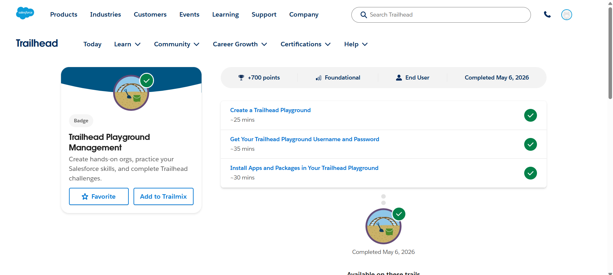
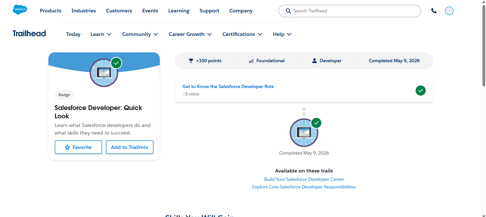
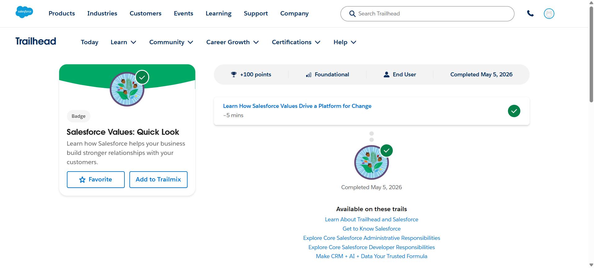
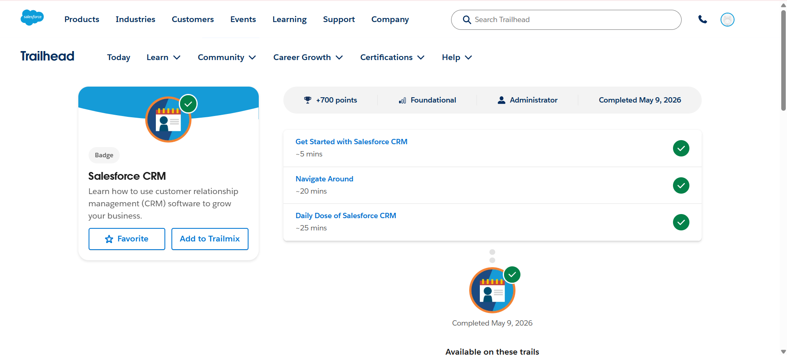

# Salesforce Summer Program – Day 1

## 📅 Date
May 2026

---

# 🎯 Day 1 Goal

Learn the fundamentals of Salesforce, CRM concepts, Salesforce architecture basics, and understand how businesses use Salesforce for automation and customer management.

---

# 📚 Topics Learned

## 1️⃣ What is Salesforce?

Salesforce is a cloud-based CRM (Customer Relationship Management) platform used by companies to manage customers, sales, support, workflows, and business processes.

### Key Points
- Runs completely on cloud
- Used by companies worldwide
- Supports automation and customization
- Provides low-code and no-code development tools
- Helps businesses centralize customer data

---

## 2️⃣ What is CRM?

CRM stands for:

> Customer Relationship Management

CRM helps companies:
- Store customer information
- Track leads and sales
- Improve customer communication
- Manage support and services
- Automate business workflows

---

# 🏢 Why Companies Use Salesforce

Companies use Salesforce because it helps:
- Reduce manual work
- Automate repetitive tasks
- Improve productivity
- Maintain customer relationships
- Generate reports and dashboards
- Store all business data in one place

---

# 👨‍💻 Salesforce Developer Role

A Salesforce Developer:
- Builds custom applications on Salesforce
- Uses Apex and Lightning components
- Works with APIs and integrations
- Customizes business processes
- Develops scalable cloud solutions

---

# 🗂️ Salesforce Basic Concepts

## 🔹 Object
An Object is like a table in a database.

### Examples
- Contact
- Account
- Opportunity
- Student (custom object)

---

## 🔹 Record
A Record is a single row/data entry inside an object.

### Example
A single student or customer entry.

---

## 🔹 Field
A Field is a column/property inside an object.

### Examples
- Name
- Email
- Phone
- Loan Amount

---

# ⚙️ Salesforce Setup Navigation

Learned about:
- Setup menu
- Object Manager
- Quick Find
- Platform Tools
- Administration menu

### Important Areas
- Users
- Profiles
- Installed Packages
- Login History
- Audit Trail

---

# ☁️ Salesforce Architecture Basics

## Learned Concepts
- Cloud Computing
- Trust
- Multitenancy
- Metadata
- APIs
- Data 360

---

# 🔌 AppExchange

AppExchange is the app marketplace of Salesforce.

### Learned
- Install apps/packages
- Use sandbox/testing environments
- Avoid direct production installation
- Check package requirements before installation

---

# 🛠️ Hands-On Activities Completed

✅ Created Trailhead Playground  
✅ Retrieved Playground username/password  
✅ Installed Dashboard Pal package  
✅ Created custom field on Contact object  
✅ Navigated Setup and Object Manager  
✅ Completed beginner Trailhead badges  

---

# 🏅 Trailhead Badges Completed

1. Trailhead Playground Management
2. Salesforce Developer: Quick Look
3. Salesforce Values: Quick Look

---

# 💡 Key Learnings

- Salesforce is more than just CRM software
- Most business processes can be automated
- Salesforce uses objects, records, and fields to manage data
- Admins and Developers have different responsibilities
- Setup is the control center of Salesforce
- AppExchange extends Salesforce functionality
- Trailhead provides hands-on learning experience

---

# ❓ Doubts / Questions

- How do real companies structure large Salesforce projects?
- How are APIs used in real-world Salesforce applications?
- What is the complete lifecycle of Salesforce development?
- How do integrations work between Salesforce and external systems?

---

# 🚀 Optional Idea

## College Management System Objects

Possible Salesforce objects:
- Student
- Faculty
- Course
- Attendance
- Fees
- Department
- Exam
- Results

---

# 📌 Conclusion

Day 1 focused on building a strong foundation in Salesforce concepts, CRM understanding, Salesforce architecture, Setup navigation, and platform basics before moving into development and automation topics.

---

# 📸 Screenshots

## Trailhead Playground Management

## Salesforce Developer: Quick Look

## Salesforce Values: Quick Look

## Salesforce CRM

