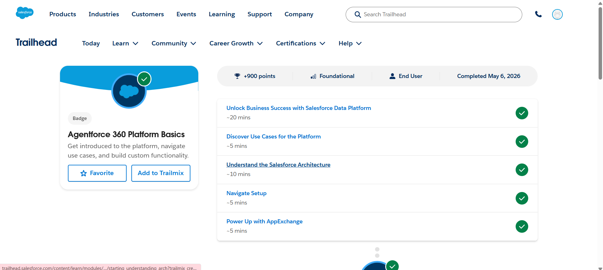

# Salesforce Summer Program – Day 2

## 📅 Date
May 2026

---

# 🎯 Day 2 Goal

Understand the Salesforce platform architecture, CRM workflows, Setup navigation, AppExchange, and real-world Salesforce business use cases.

---

# 📚 Topics Learned

# 1️⃣ Agentforce 360 Platform Basics

Learned the core foundation of the Salesforce platform and how businesses use Salesforce for automation and digital transformation.

## Key Learnings
- Salesforce is a cloud-based platform
- Businesses use Salesforce for CRM and workflow automation
- Salesforce supports low-code and no-code development
- Salesforce architecture is metadata-driven
- Different departments can use Salesforce

---

# 2️⃣ Salesforce CRM Basics

Learned how Salesforce CRM helps companies manage customers, leads, and business operations.

## CRM Concepts Learned
- Leads
- Contacts
- Accounts
- Opportunities
- Customer relationship management workflow
- Business process automation

---

# 🏗️ Salesforce Architecture

Learned important platform concepts:

## ☁️ Cloud Computing
Salesforce runs fully on cloud infrastructure.

## 🔐 Trust
Salesforce focuses heavily on:
- Security
- Reliability
- Transparency

### Important Resource
- trust.salesforce.com

---

## 🏢 Multitenancy

Multiple companies share the same Salesforce infrastructure securely.

### Benefits
- Shared resources
- Automatic updates
- Scalability
- Lower maintenance

---

## 🗂️ Metadata

Metadata means:

> Data about data

Examples:
- Objects
- Fields
- Layouts
- Security settings

Metadata defines the structure of the Salesforce org.

---

## 🔌 APIs

APIs help Salesforce communicate with:
- Mobile apps
- External systems
- Integrations
- Email templates

Learned that APIs allow secure data exchange between systems.

---

# 🧠 Salesforce Platform Use Cases

Learned how different departments use Salesforce.

## 🏠 Real Estate Example (Dreamhouse)

Salesforce can help:
- Manage property listings
- Track buyers
- Automate workflows
- Send AI-generated emails

---

## 👨‍💼 HR Department Use Cases

Salesforce can automate:
- Hiring process
- Employee onboarding
- Training plans
- Leave tracking

---

## 💻 IT Department Use Cases

Salesforce can manage:
- IT tickets
- Asset tracking
- Request routing
- Support workflows

---

## 💰 Finance Department Use Cases

Salesforce supports:
- Budget management
- Contract management
- Pricing workflows

---

# ⚙️ Setup Navigation

Learned how to navigate Salesforce Setup.

## Important Areas
- Object Manager
- Quick Find
- Platform Tools
- Administration
- Settings

---

# 🗂️ Salesforce Data Model Basics

Learned the relationship between:

| Concept | Meaning |
|---|---|
| Object | Database table |
| Record | Single row/data |
| Field | Column/property |

---

# 🔌 AppExchange

Learned about Salesforce AppExchange marketplace.

## Learned Concepts
- Install apps and packages
- Use sandbox/testing environments
- Avoid direct production installation
- Review app requirements before installation

---

# 🛠️ Hands-On Activities Completed

✅ Created and managed Trailhead Playgrounds  
✅ Installed packages using AppExchange  
✅ Navigated Salesforce Setup  
✅ Created custom fields  
✅ Explored Object Manager  
✅ Completed CRM and Platform Basics modules  

---

# 🏅 Trailhead Badges Completed

1. Agentforce 360 Platform Basics
2. Salesforce CRM

---

# 💡 Key Learnings

- Salesforce is more than a CRM tool
- Most business processes can be automated
- Salesforce architecture is built on metadata
- APIs are important for integrations
- Different departments can use Salesforce differently
- Setup is the main admin workspace
- AppExchange extends Salesforce functionality

---

# ❓ Doubts / Questions

- How are real-world Salesforce projects deployed?
- How do APIs integrate external systems with Salesforce?
- What are the best practices for Salesforce app development?
- How does Salesforce handle very large-scale enterprise data?

---

# 📌 Conclusion

Day 2 focused on understanding Salesforce platform architecture, CRM workflows, Setup navigation, AppExchange, metadata concepts, APIs, and real-world business use cases across different departments.

---

# 📸 Screenshots

## Agentforce 360 Platform Basics

## Agentforce 360 Platform Development Basics

