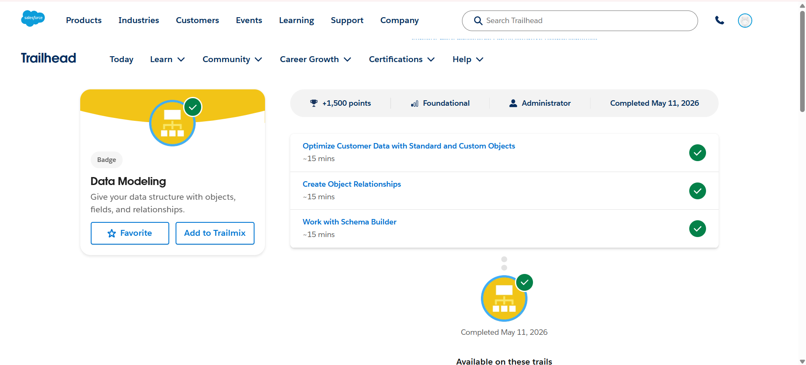
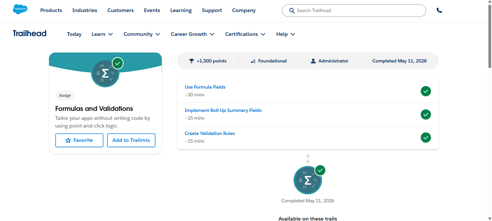

# Salesforce Summer Program – Day 3

## 📅 Date
May 2026

---

# 🎯 Day 3 Goal

Learn Salesforce data modeling concepts, object relationships, schema design, formula fields, roll-up summary fields, and validation rules.

---

# 📚 Topics Learned

# 1️⃣ Data Modeling

Learned how Salesforce organizes and structures data using:
- Objects
- Fields
- Relationships

Data modeling helps businesses maintain structured and connected information inside Salesforce.

---

# 🗂️ Standard and Custom Objects

## Standard Objects
Objects already provided by Salesforce.

### Examples
- Account
- Contact
- Opportunity
- Lead

---

## Custom Objects
Objects created based on business requirements.

### Example
- Student
- Course
- Attendance
- Property

---

# 🔗 Object Relationships

Learned how objects connect with each other.

## Relationship Types Learned

### Lookup Relationship
- Loose connection between objects
- Child record can exist independently

### Master-Detail Relationship
- Strong parent-child relationship
- Child depends on parent
- Supports roll-up summary fields

---

# 🏗️ Schema Builder

Learned how to visually design and understand:
- Objects
- Fields
- Relationships

using Schema Builder.

### Benefits
- Easy visualization
- Better understanding of data structure
- Drag-and-drop relationship design

---

# ➕ Formula Fields

Learned how formula fields automatically calculate values without storing data manually.

## Examples Learned
- Days remaining calculation
- Discount calculations
- Hyperlinks
- Date differences

---

# 🧮 Formula Concepts Learned

## Functions
Examples:
- TODAY()
- LEN()
- ROUND()
- AND()

---

## Operators
Examples:
- +
- -
- <>
- =

---

## Cross-Object Formulas
Accessing related object fields.

# 📸 Screenshots

## Data Modeling

## Formulas and Validations

