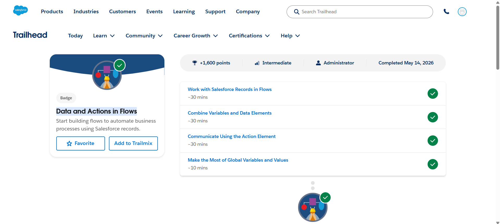
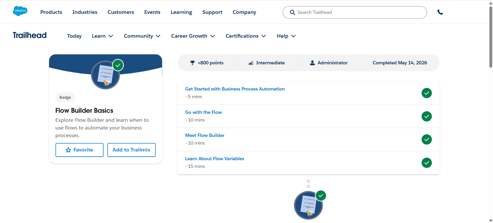

# Salesforce Summer Program – Day 4

## 📅 Date
May 2026

---

# 🎯 Day 4 Goal

Learn Salesforce Flow Builder fundamentals, automation concepts, variables, records handling, actions, and communication automation using flows.

---

# 📚 Topics Learned

# 1️⃣ Flow Builder Basics

Learned the basics of Salesforce Flow Builder and how businesses automate processes without coding.

## Key Learnings
- What Flow Builder is
- Why flows are used
- Types of Salesforce flows
- Automation using declarative tools
- Business process automation concepts

---

# 🔄 Types of Flows Learned

## Record-Triggered Flow
Automatically runs when:
- A record is created
- A record is updated
- A record is deleted

---

## Screen Flow
Used to:
- Collect user input
- Build guided forms
- Create interactive automation

---

## Autolaunched Flow
Runs automatically in the background without screens.

---

# 🧠 Flow Builder Components

Learned important Flow Builder elements:

## Start Element
Defines:
- Trigger object
- Trigger conditions
- When the flow runs

---

## Get Records
Used to:
- Retrieve Salesforce records
- Query related data

---

## Update Records
Used to:
- Modify existing records automatically

---

## Create Records
Creates new Salesforce records automatically.

---

## Decision Element
Used for:
- Conditional logic
- Multiple flow paths

---

## Action Element
Used to:
- Send emails
- Post to Chatter
- Submit approvals
- Trigger platform actions

---

# 📦 Variables in Flows

Learned how variables store and transfer data inside flows.

## Variable Concepts
- Text variables
- Number variables
- Record variables
- Collection variables

---

## Global Variables Learned
Examples:
- $Record
- $User
- $Flow

---

# 🔗 Working with Salesforce Records

Learned how flows interact with Salesforce data.

## Operations Performed
- Get records
- Update records
- Create records
- Use related records
- Use record variables

---

# 💬 Communication Using Action Elements

Learned how flows automate communication.

## Features Learned
- Send email alerts
- Post to Chatter
- Mention users in Chatter
- Trigger notifications

---

# 📝 Text Templates

Learned how text templates are used in flows.

## Uses
- Email body content
- Chatter messages
- Dynamic merge fields

---

# 📣 Chatter Automation

Learned how to:
- Create automated Chatter posts
- Mention users using OwnerId
- Use Action elements for collaboration

---

# 📧 Email Automation

Learned:
- Email Alerts
- Public Groups
- Trigger-based email notifications

---

# ⚙️ Hands-On Activities Completed

✅ Built Record-Triggered Flows  
✅ Used Get Records element  
✅ Used Update Records element  
✅ Created Text Templates  
✅ Sent automated Chatter posts  
✅ Configured Email Alerts  
✅ Used Action elements  
✅ Worked with variables and resources  
✅ Automated Lead matching process  

---

# 🏅 Trailhead Badges Completed

1. Data and Actions in Flows
2. Flow Builder Basics

---

# 💡 Key Learnings

- Flow Builder is a powerful no-code automation tool
- Flows can automate business processes efficiently
- Variables help transfer data between flow elements
- Action elements support communication automation
- Salesforce flows can interact with records dynamically
- Chatter and email automation improve collaboration
- Record-triggered flows are widely used in real projects

---

# ❓ Doubts / Questions

- How are large enterprise flows optimized?
- What are flow governor limits?
- When should Apex be used instead of Flow?
- How can complex approval processes be automated?

---

# 📌 Conclusion

Day 4 focused on Salesforce Flow Builder, automation concepts, variables, records handling, action elements, Chatter automation, email automation, and building real-world business workflows without coding.

---

# 📸 Screenshots

## Data and Actions in Flows

## Flow Builder Basics

