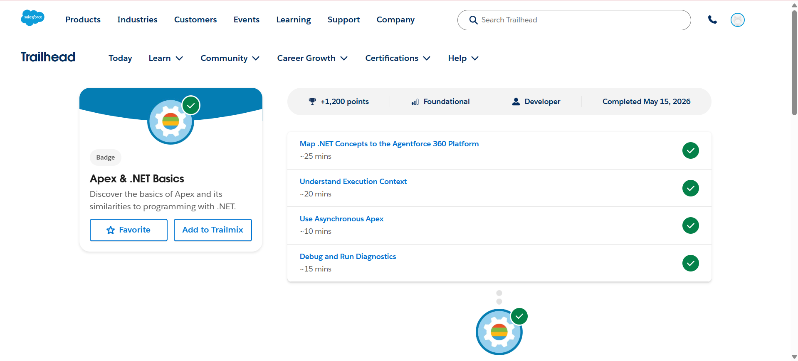
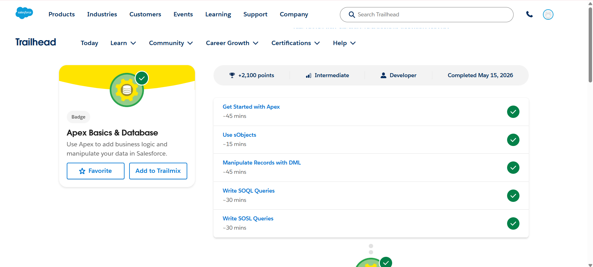

# Salesforce Summer Program – Day 5

## 📅 Date
May 2026

---

# 🎯 Day 5 Goal

Learn Apex programming fundamentals, Salesforce database operations, SOQL/SOSL queries, execution context, asynchronous Apex, and debugging concepts.

---

# 📚 Topics Learned

# 1️⃣ Apex & .NET Basics

Learned the fundamentals of Apex programming language and how it relates to object-oriented programming concepts similar to .NET.

---

## 🧠 What is Apex?

Apex is Salesforce’s:
- Object-oriented programming language
- Strongly typed language
- Server-side programming language

Used for:
- Business logic
- Automation
- Database operations
- Integrations

---

## 🔄 Apex Features Learned

### Object-Oriented Programming
Learned concepts like:
- Classes
- Methods
- Objects
- Variables

---

## ☁️ Salesforce Execution Context

Learned how Apex runs inside Salesforce environment.

### Important Concepts
- Governor Limits
- Multi-tenant architecture
- Resource sharing
- Transaction control

---

## ⚡ Asynchronous Apex

Learned how Salesforce performs background processing.

### Types Learned
- Future Methods
- Queueable Apex
- Batch Apex
- Scheduled Apex

### Benefits
- Faster processing
- Better performance
- Handles large data operations

---

## 🐞 Debugging and Diagnostics

Learned:
- Debug logs
- Execution tracking
- Error analysis
- Troubleshooting Apex code

---

# 2️⃣ Apex Basics & Database

Learned how Apex interacts with Salesforce database using:
- sObjects
- DML
- SOQL
- SOSL

---

# 📸 Screenshots

## Apex & .NET Basics

---

## Apex Basics & Database

