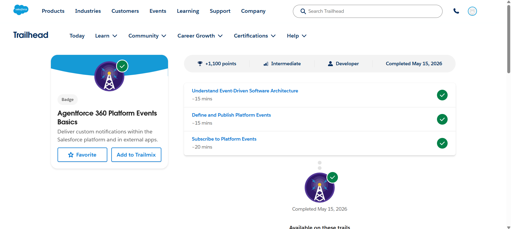
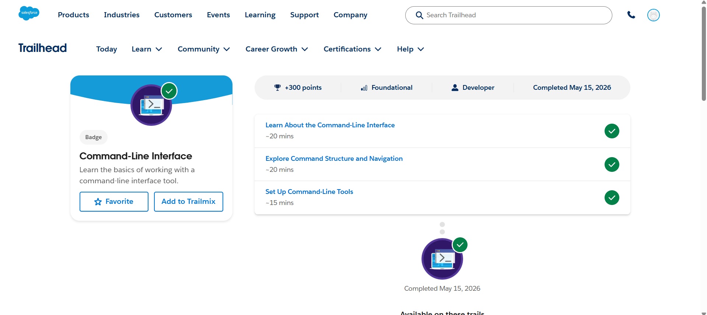
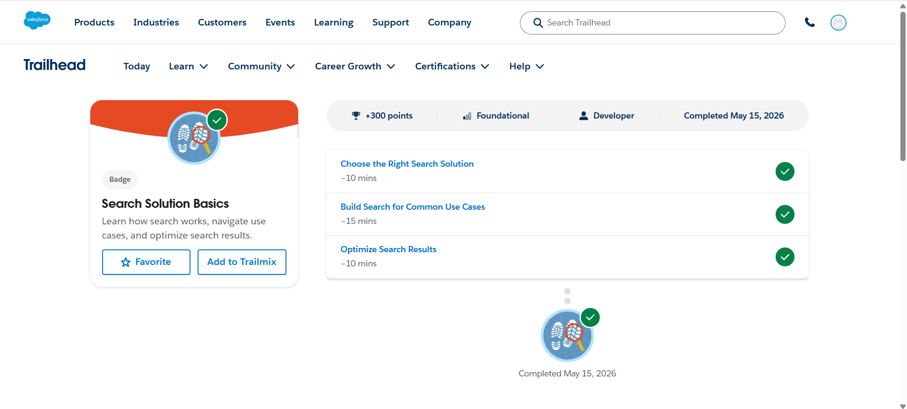

# Salesforce Summer Program – Day 6

## 📅 Date
May 2026

---

# 🎯 Day 6 Goal

Learn Salesforce platform events, event-driven architecture, command-line interface basics, search optimization concepts, and Salesforce developer productivity tools.

---

# 📚 Topics Learned

# 1️⃣ Agentforce 360 Platform Events Basics

Learned how Salesforce uses event-driven architecture for real-time communication and automation.

---

# ⚡ Event-Driven Architecture

Learned that systems can communicate using:
- Events
- Notifications
- Real-time updates

Instead of continuous polling.

---

## 📡 Platform Events

Platform Events allow Salesforce to:
- Send notifications
- Trigger automation
- Communicate with external systems
- Process real-time business events

---

## 🔄 Publish and Subscribe Model

Learned how event systems work using:

### Publisher
Creates and sends events.

### Subscriber
Listens and reacts to events.

---

## 🧠 Platform Event Use Cases

Examples:
- Order notifications
- Payment confirmations
- Inventory updates
- IoT device communication
- Real-time alerts

---

## ☁️ Event Benefits

- Real-time communication
- Loose system coupling
- Better scalability
- Easier integrations
- Faster processing

---

# 2️⃣ Command-Line Interface (CLI)

Learned how developers use command-line tools for Salesforce development.

---

# 💻 CLI Basics

CLI helps developers:
- Create projects
- Deploy code
- Authenticate orgs
- Run commands faster

---

## 🛠️ Salesforce CLI Features Learned

### Org Management
- Connect Salesforce orgs
- Authenticate environments

---

### Project Management
- Create Salesforce DX projects
- Manage metadata

---

### Deployment
- Push and retrieve source code
- Deploy applications

---

### Testing and Debugging
- Run tests
- Check logs
- Monitor deployments

---

# 📸 Screenshots

## Agentforce 360 Platform Events Basics

---

## Command-Line Interface

---

## Search Solution Basics

