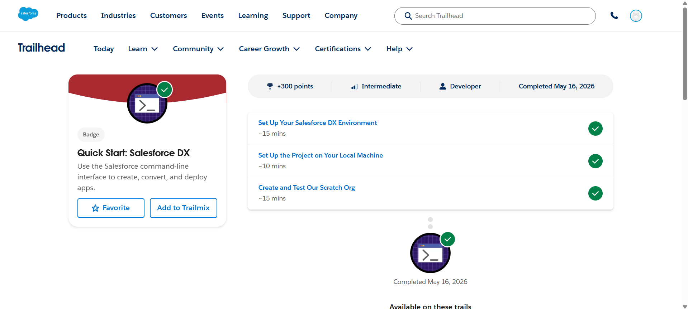
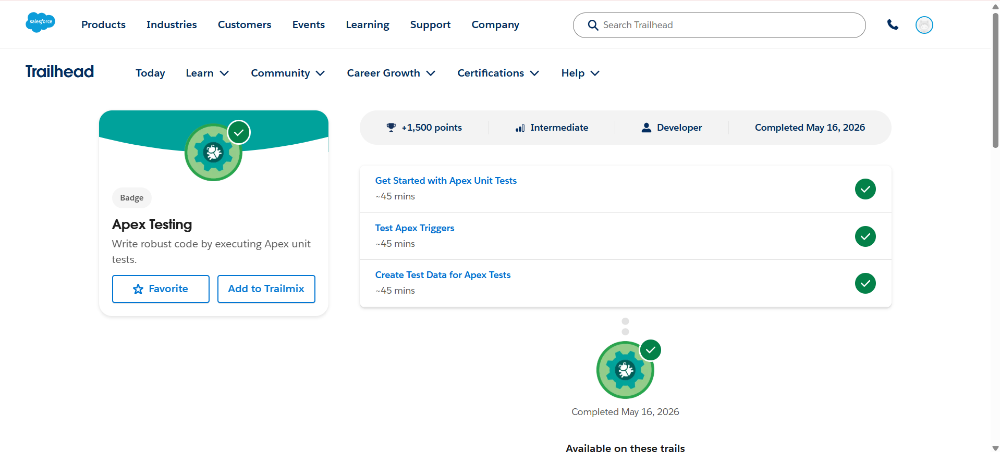

# Day 1 - Salesforce Trailhead

## Topics Covered
- Salesforce DX
- Apex Testing
- Scratch Org Setup
- Apex Unit Tests

---

## Modules Completed

### 1. Quick Start: Salesforce DX
This module covered:
- Setting up Salesforce DX Environment
- Creating local projects
- Creating and testing Scratch Orgs

### 2. Apex Testing
This module covered:
- Apex Unit Tests
- Test Apex Triggers
- Creating test data for Apex tests

---

## Learning Outcomes
- Learned how to configure Salesforce DX
- Understood Scratch Org creation
- Learned basics of Apex testing
- Practiced Trailhead modules

---

# Screenshots

## Quick Start: Salesforce DX

---

## Apex Testing

