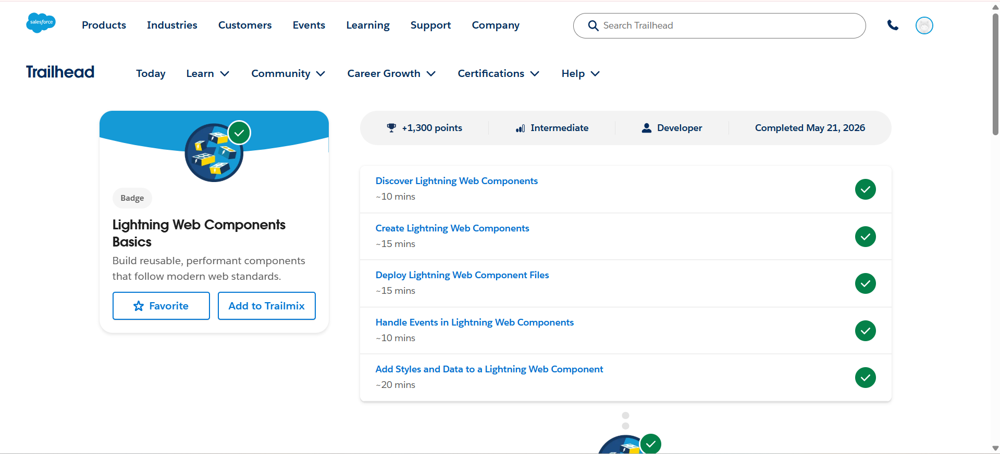
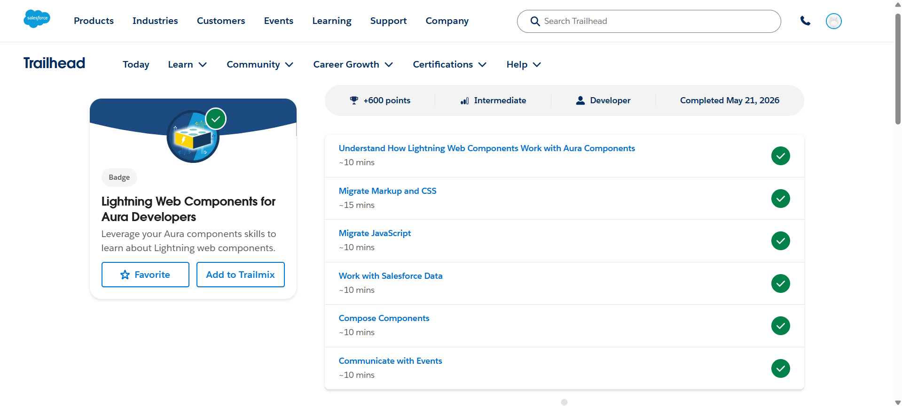
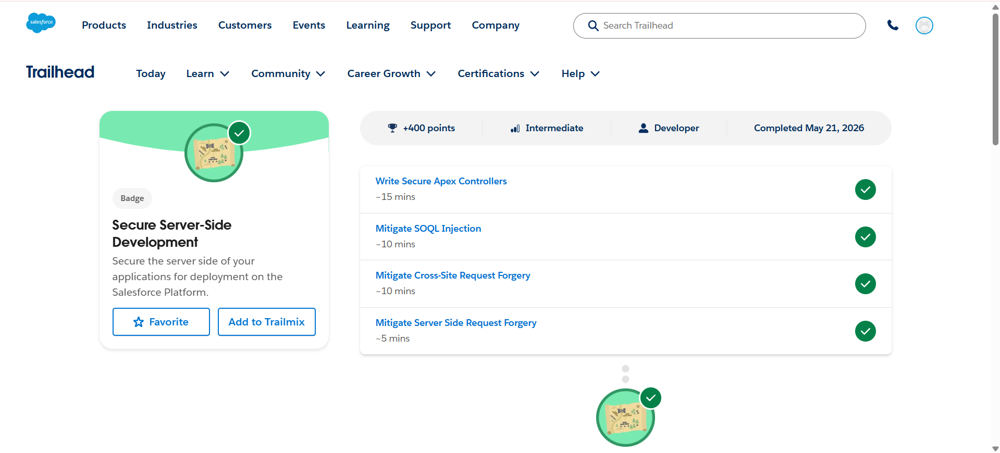

# Day 2 - Salesforce Trailhead

## Topics Covered
- Lightning Web Components (LWC)
- Aura Components
- Secure Server-Side Development
- Salesforce Component Communication

---

## Modules Completed

### 1. Lightning Web Components Basics
This module covered:
- Introduction to Lightning Web Components
- Creating Lightning Web Components
- Deploying Component Files
- Handling Events in Components
- Adding Styles and Data

### 2. Lightning Web Components for Aura Developers
This module covered:
- Working with Aura Components
- Migrating Markup and CSS
- Migrating JavaScript
- Working with Salesforce Data
- Component Communication using Events

### 3. Secure Server-Side Development
This module covered:
- Writing Secure Apex Controllers
- Preventing SOQL Injection
- Mitigating Cross-Site Request Forgery
- Preventing Server-Side Request Forgery

---

## Learning Outcomes
- Learned Lightning Web Components architecture
- Understood Aura to LWC migration
- Learned secure coding practices in Salesforce
- Practiced component-based development

---

# Screenshots

## Lightning Web Components Basics

---

## Lightning Web Components for Aura Developers

---

## Secure Server-Side Development

