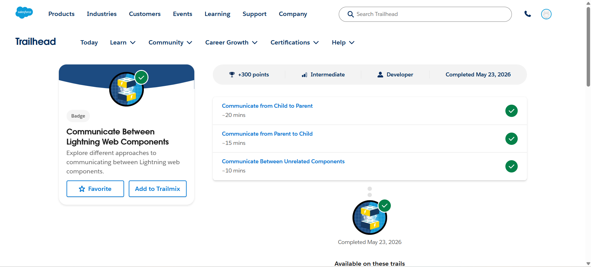
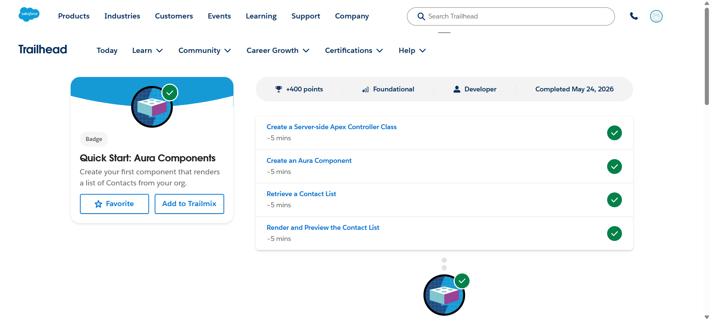

# Day 3 - Salesforce Trailhead

## Topics Covered
- Lightning Web Component Communication
- Parent and Child Components
- Aura Components
- Apex Controller Integration

---

## Modules Completed

### 1. Communicate Between Lightning Web Components
This module covered:
- Communication from Child to Parent
- Communication from Parent to Child
- Communication Between Unrelated Components

### 2. Quick Start: Aura Components
This module covered:
- Creating a Server-side Apex Controller
- Creating Aura Components
- Retrieving Contact List Data
- Rendering and Previewing Contact Lists

---

## Learning Outcomes
- Learned communication techniques in LWC
- Understood parent-child component interaction
- Practiced Aura component creation
- Connected Apex controllers with components

---

# Screenshots

## Communicate Between Lightning Web Components

---

## Quick Start Aura Components

