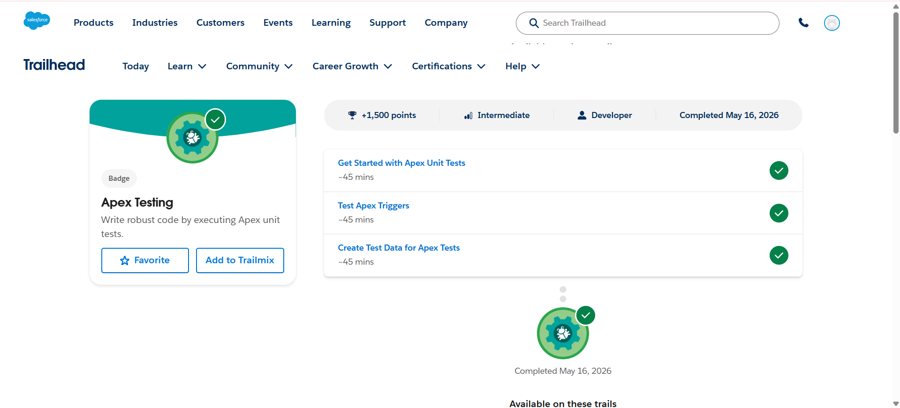
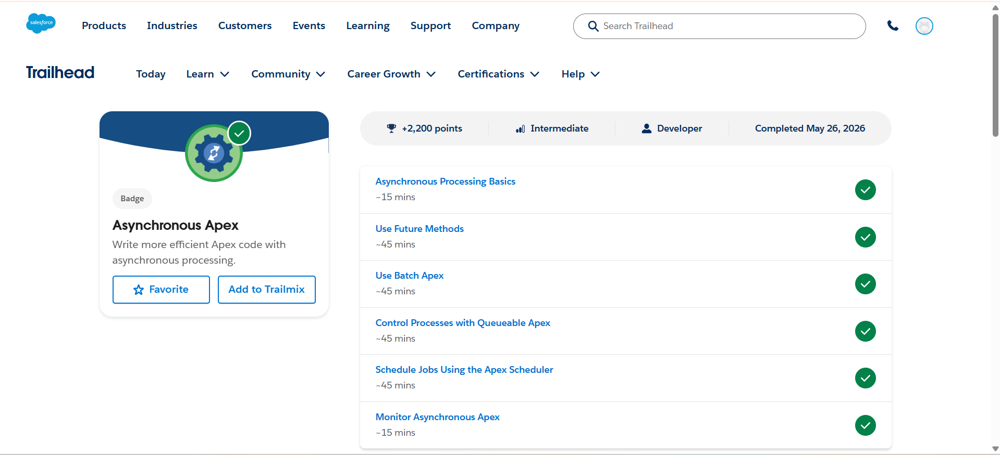

# Salesforce Summer Program – Week 2 Day 4

## 📅 Date
May 2026

---

# 🎯 Day 4 Goal

Learn Apex Testing and Asynchronous Apex concepts including unit testing trigger testing batch apex queueable apex and scheduled jobs in Salesforce

---

# 📚 Topics Learned

# 1️⃣ Apex Testing

Learned how Salesforce uses Apex unit tests to validate business logic and improve application reliability

## Key Learnings
- Apex tests help verify code functionality
- Test classes use `@isTest`
- Salesforce requires minimum test coverage
- Assertions are used to check expected results
- Test data should be created inside test classes

---

## 🧪 Test Apex Triggers

Learned how to test trigger automation using test records

### Concepts Learned
- Insert records in tests
- Update records for trigger execution
- Validate results using assertions
- Test automation logic

---

## 🗂️ Create Test Data for Apex Tests

Learned how to create sample data for testing purposes

### Important Concepts
- Create Accounts Contacts and Opportunities
- Use isolated testing environment
- Avoid dependency on org data
- Improve reusability of test methods

---

# 2️⃣ Asynchronous Apex

Learned how Salesforce executes background processes asynchronously

## Key Learnings
- Improves system performance
- Handles large data efficiently
- Executes long running tasks in background
- Reduces user waiting time

---

## 🔄 Future Methods

Learned how future methods process operations asynchronously

### Concepts Learned
- Use `@future` annotation
- Background execution
- Useful for asynchronous operations and callouts

---

## 📦 Batch Apex

Learned Batch Apex for processing large datasets

### Benefits
- Processes records in batches
- Handles large scale operations
- Supports scheduling

---

## ⚙️ Queueable Apex

Learned Queueable Apex for better asynchronous control

### Features
- Supports job chaining
- Better monitoring than future methods
- Handles complex processing

---

## ⏰ Apex Scheduler

Learned how to automate jobs at scheduled times

### Uses
- Daily reports
- Maintenance jobs
- Automated operations

---

## 📊 Monitor Asynchronous Apex

Learned how to monitor running asynchronous jobs

### Learned Areas
- Apex Jobs page
- Job status tracking
- Error monitoring

---

# 🛠️ Hands-On Activities Completed

✅ Created Apex test classes  
✅ Tested Apex triggers  
✅ Created test data for testing  
✅ Learned Future Methods  
✅ Explored Batch Apex  
✅ Worked with Queueable Apex  
✅ Learned Apex Scheduler  
✅ Monitored asynchronous jobs  

---

# 🏅 Trailhead Badges Completed

1. Apex Testing  
2. Asynchronous Apex  

---

# 💡 Key Learnings

- Apex testing is required for deployment
- Test coverage improves application quality
- Asynchronous Apex improves efficiency
- Batch Apex handles large records
- Queueable Apex provides advanced async processing
- Scheduled Apex automates recurring jobs

---

# ❓ Doubts / Questions

- Difference between Batch Apex and Queueable Apex in real projects
- Best practices for scalable test classes
- How enterprise projects manage asynchronous jobs

---

# 📌 Conclusion

Day 4 of Week 2 focused on learning Apex Testing and Asynchronous Apex concepts including unit testing trigger testing future methods batch apex queueable apex scheduling jobs and monitoring asynchronous processing in Salesforce

---

# 📸 Screenshots

## Apex Testing

## Asynchronous Apex

