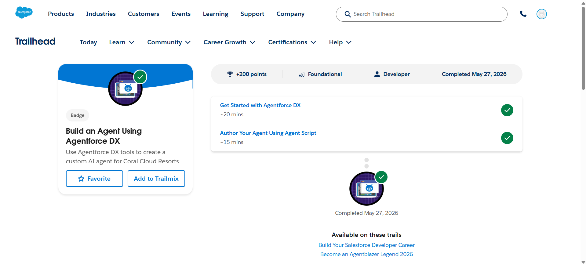
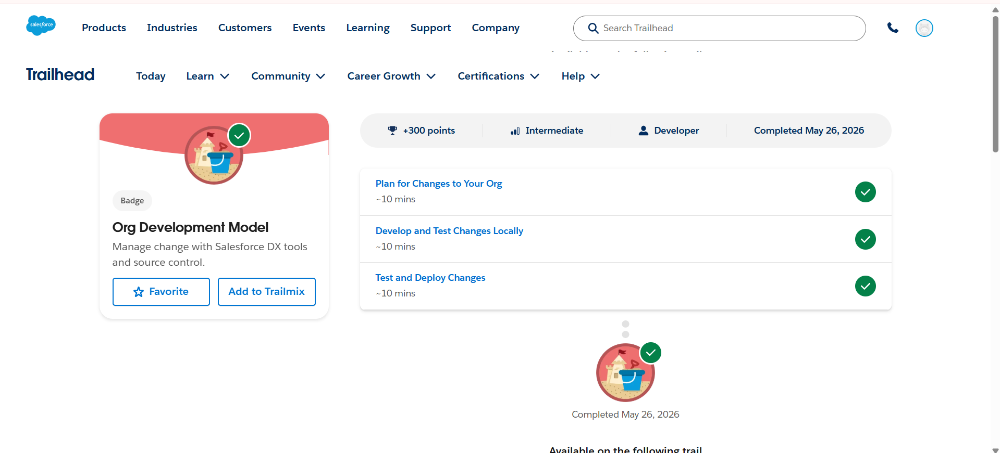

# Day 5 - Salesforce Trailhead

## Topics Covered
- Agentforce DX
- AI Agent Development
- Salesforce DX Workflow
- Org Development Model
- Local Development and Deployment

---

## Modules Completed

### 1. Build an Agent Using Agentforce DX
This module covered:
- Getting Started with Agentforce DX
- Authoring Agents Using Agent Script
- Creating AI-powered Salesforce Agents
- Agent Development Workflow

### 2. Org Development Model
This module covered:
- Planning Changes to Salesforce Org
- Developing and Testing Changes Locally
- Testing and Deploying Changes
- Source Control and Deployment Workflow

---

## Learning Outcomes
- Learned basics of Agentforce DX
- Understood AI agent development workflow
- Practiced Salesforce DX development process
- Learned deployment and org management concepts

---

# Screenshots

## Build an Agent Using Agentforce DX

---

## Org Development Model

