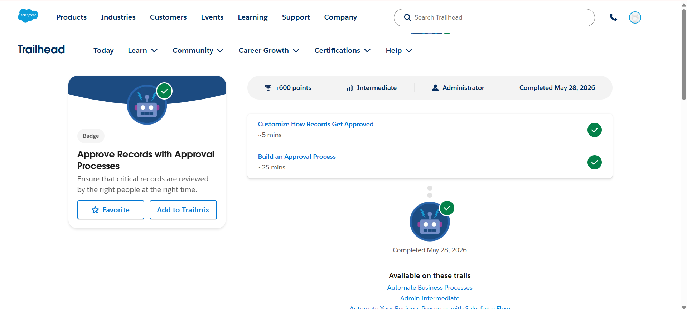
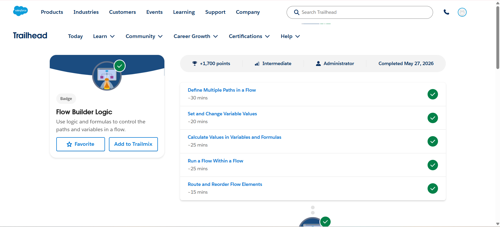

# Day 6 - Salesforce Trailhead

## Topics Covered
- Approval Processes
- Record Approval Automation
- Flow Builder Logic
- Variables and Formulas in Flow
- Flow Routing and Automation

---

## Modules Completed

### 1. Approve Records with Approval Processes
This module covered:
- Customizing Record Approval Processes
- Building Approval Workflows
- Automating Approval Steps
- Managing Approval Requests

### 2. Flow Builder Logic
This module covered:
- Defining Multiple Paths in a Flow
- Setting and Changing Variable Values
- Calculating Values Using Formulas
- Running Flows Within Flows
- Routing and Reordering Flow Elements

---

## Learning Outcomes
- Learned Salesforce Approval Process automation
- Understood Flow Builder logic and routing
- Practiced working with variables and formulas
- Learned process automation techniques in Salesforce

---

# Screenshots

## Approve Records with Approval Processes

---

## Flow Builder Logic

