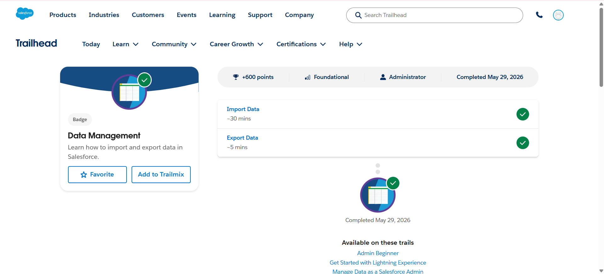
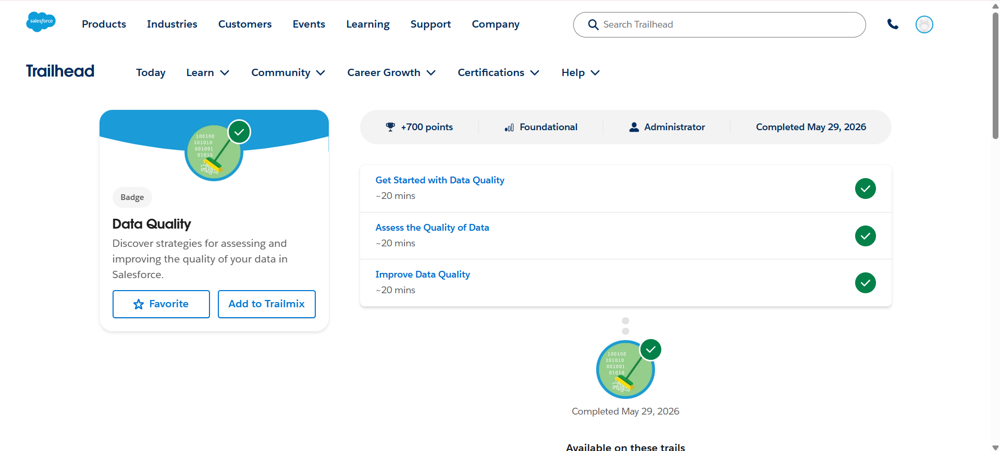

# Day 1 - Salesforce Trailhead

## Topics Covered
- Data Management in Salesforce
- Data Import and Export
- Data Quality Assessment
- Data Quality Improvement

---

## Modules Completed

### 1. Data Management
This module covered:
- Importing Data into Salesforce
- Exporting Data from Salesforce
- Managing Records Efficiently
- Understanding Data Migration Basics

### 2. Data Quality
This module covered:
- Getting Started with Data Quality
- Assessing Data Quality
- Improving Data Quality
- Maintaining Accurate and Reliable Data

---

## Learning Outcomes
- Learned how to import and export data in Salesforce
- Understood the importance of data quality
- Practiced data management techniques
- Learned methods to assess and improve data quality

---

# Screenshots

## Data Management

---

## Data Quality

