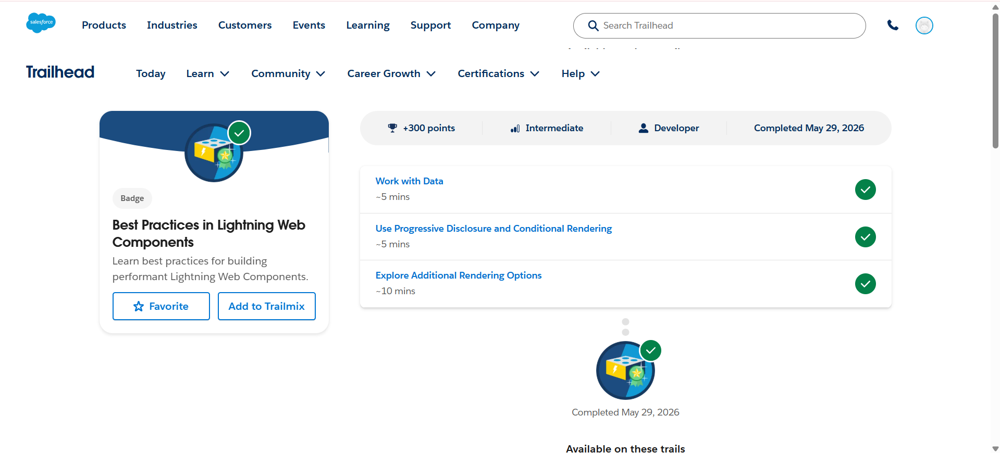
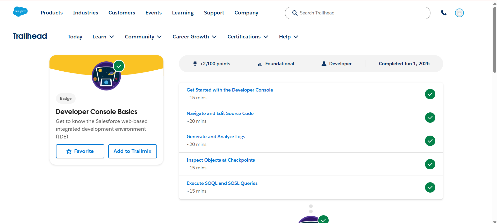
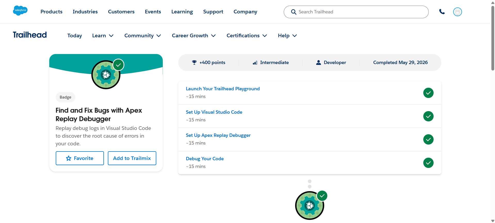

# Day 2 - Salesforce Trailhead

## Topics Covered
- Lightning Web Components Best Practices
- Developer Console
- Apex Replay Debugger
- Debugging and Log Analysis
- Salesforce Development Tools

---

## Modules Completed

### 1. Best Practices in Lightning Web Components
This module covered:
- Working with Data Efficiently
- Progressive Disclosure and Conditional Rendering
- Additional Rendering Options
- Building Performant Lightning Web Components

### 2. Developer Console Basics
This module covered:
- Getting Started with the Developer Console
- Navigating and Editing Source Code
- Generating and Analyzing Logs
- Inspecting Objects at Checkpoints
- Executing SOQL and SOSL Queries

### 3. Find and Fix Bugs with Apex Replay Debugger
This module covered:
- Launching Trailhead Playground
- Setting Up Visual Studio Code
- Configuring Apex Replay Debugger
- Debugging Apex Code
- Analyzing Execution Logs

---

## Learning Outcomes
- Learned best practices for Lightning Web Component development
- Understood how to use the Salesforce Developer Console
- Practiced SOQL and SOSL query execution
- Learned debugging techniques using Apex Replay Debugger
- Improved troubleshooting and log analysis skills

---

# Screenshots

## Best Practices in Lightning Web Components

---

## Developer Console Basics

---

## Find and Fix Bugs with Apex Replay Debugger

